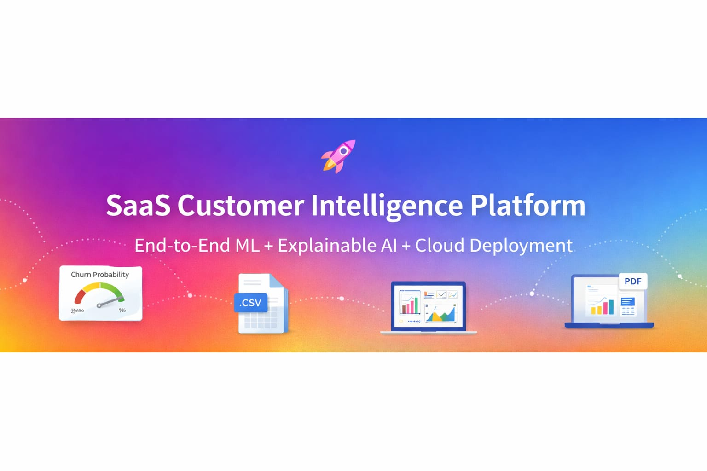
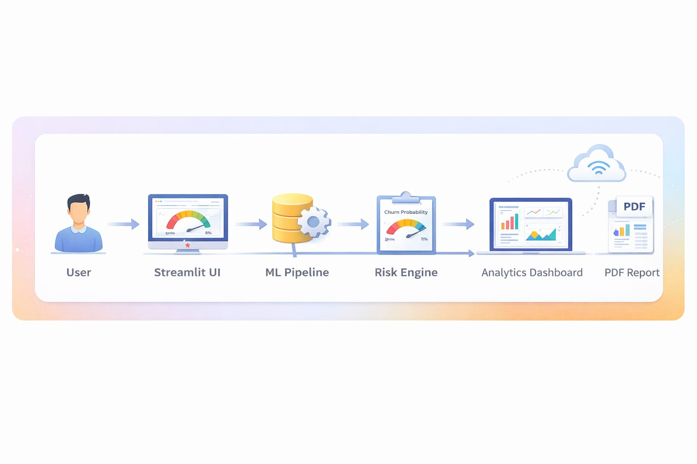
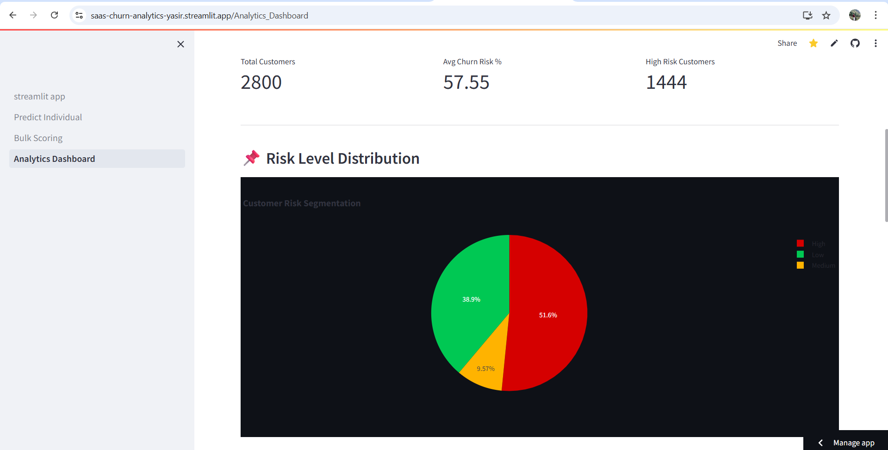
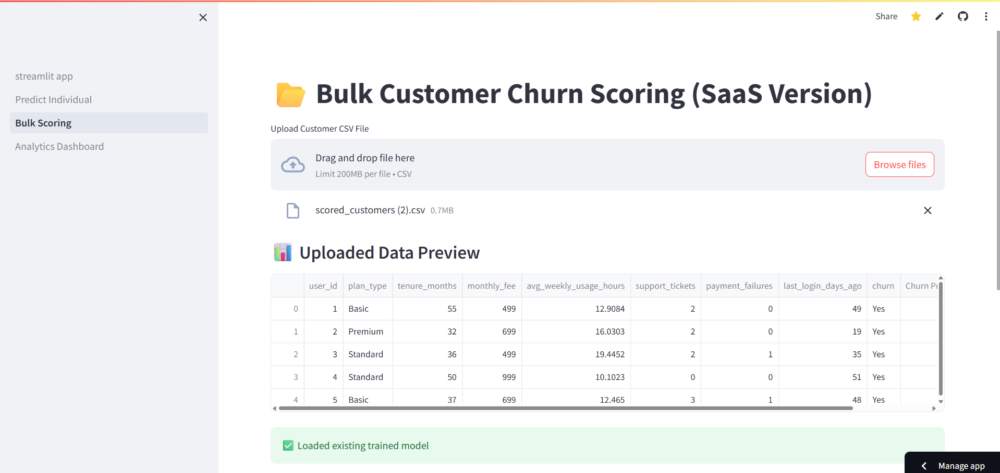

<p align="center">  </p> <p align="center"> <b>Enterprise-Grade Churn Prediction & Revenue Analytics</b><br> End-to-End ML Pipeline • Risk Segmentation • Live Deployment </p>


🔗 **Live Demo:** https://saas-churn-analytics-yasir.streamlit.app  
📂 **GitHub Repo:** https://github.com/yasirpt07/SaaS-Churn-Analytics  

---




## 🏗 Architecture


## 📸 Application Screenshots
### 📊 Analytics Dashboard


### 📂 Bulk Scoring



## 📊 Project Overview

An end-to-end SaaS-style Machine Learning platform designed to:

- Predict customer churn risk  
- Perform bulk customer scoring (CSV upload)  
- Provide interactive churn analytics dashboards  
- Deliver AI-based explainability (SHAP)  
- Generate downloadable PDF churn reports  

This project simulates a real-world subscription-based SaaS business environment.

---

## 🎯 Business Problem

Customer churn directly impacts revenue in subscription-based businesses.

This platform helps businesses:

- Identify high-risk customers  
- Understand churn drivers  
- Segment customers by risk level  
- Prioritize retention strategies  
- Monitor churn trends through interactive dashboards  

---

## 💼 Real-World Application

This platform simulates a subscription-based SaaS business environment
and demonstrates how ML can:

- Reduce churn
- Increase recurring revenue
- Improve retention strategies
- Provide explainable AI insights


## ⚙️ Run Locally

```bash
git clone https://github.com/yasirpt07/SaaS-Churn-Analytics.git
cd SaaS-Churn-Analytics
pip install -r requirements.txt
streamlit run streamlit_app.py
